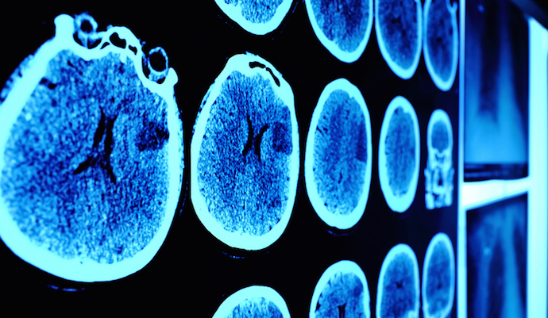

# Breast Tumor Classifier
</a> 
  

## 📍 Problem Statement
Tumors in the breast can either be benign or malignant. A common mistake made by people is that they take all tumors in the breast to be breast cancer which most times is not the case.
   

## 📍 Objective 
This projects centers on building a predictive model to predict whether a breast tumor is benign or malignant.
   

## 📍 Data
The dataset was in a tabular (CSV) format and was gotten from a research studies, which was subsequently cleaned and wrangled in preparation for machine learning.   

## 📍 Skills and Technologies

* Programming (Python, JavaScript)
* Data wrangling (Pandas, Numpy)
* Data Analysis and Visualization. (Numpy, Stat, Seaborn, Matplotlib)
* Machine/ Deep learning (Tensorflow, Scikit Learn, XGBoost)
* Backend (Flask)
* Frontend (HTML, CSS, Bootstrap)
* Cloud deployment (Render, Heroku)
   

## 📍 APP VIEW

#### [Tumpred](https://tumpred.up.railway.app/)
| | 
|:-|
| |

  

## 📍 Notebook
#### This Jupyter notebook containing some exploratory analysis, model training and evaluation can be found [Here](https://github.com/Ajisco/Breast-Tumor-Predictions-using-SVM/blob/master/Breast%20Tumor%20Predictions%20using%20SVM.ipynb)    

## 📍 App Features
1. Has a section to fill form to collect data.
2. Machine learning classifies the type of tumor.
3. There is an option to read more on the tumor type.
4. Has a link to a site for more information.
5. Web app compatible by every device.    

## 📍 DEPLOYMENT 🚀

#### This app is deployed at [Render](https://railway.app/)
	
#### You can access it [Here](https://tumpred.up.railway.app/)    

## 📍 Limitations
1. The dataset used was not large enough, could be outdated and can't be said to have generalized well despite the high metric values.
2. The app's interface could be better.
3. The app can only be used by medical proffessionals due to some unclear parameters, hence not very user friendly.   

## 📍 To improve
1. I would love to improve the dataset in size and quality.
2. I would love to add a computer vision based system that allows to snap picture of the tumor or radiographs for diagnoses.
3. I would love to add an NLP virtual assistant system inform of a medical chatbot to attend to users before seeing a doctor.
   

## 📍 Open to collaboration
You can  create a pull request wit detailed explanation if you wiould love to work more on this, or contact me through:

	
	
	
  
	

